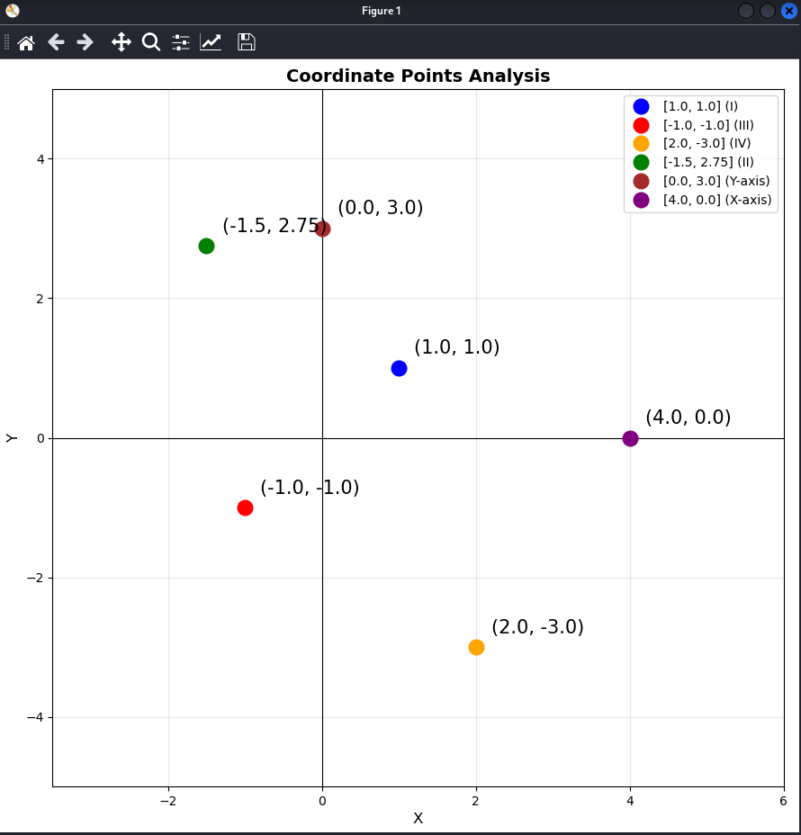

# Coordinate Points Analyzer 📊
A Python program for analyzing and visualizing points on a coordinate plane, defining it's position and angle

## Features
- ✅ Determine which quadrant a point belongs to
- ✅ Calculate distance from origin
- ✅ Calculate angle with X-axis
- ✅ Interactive coordinate input
- ✅ Automatic graph scaling
- ✅ Color-coded quadrants

## Installation

1. Clone the repository:
```bash
git clone https://github.com/Sarmatae685/coordinate-analyzer.git
cd coordinate-analyzer
```

2. Install dependencies:
```bash
pip3 install -r requirements.txt
```

3. Run the program:
```bash
python3 coordinate_analyzer.py
```

## Example of usage
### Enter coords:
```bash
==================================================
ANALYSIS OF POINT COORDINATES
==================================================

Enter the coordinates of the points.
To complete the entry, leave the field blank and press Enter.


--- Point 1 ---
Enter the coordinate X: 1
Enter the coordinate Y: 1
✓ Added point: (1, 1)

--- Point 2 ---
Enter the coordinate X: -1
Enter the coordinate Y: -1
✓ Added point: (-1, -1)

--- Point 3 ---
Enter X coordinate: [Enter to finish]
...
```
### After processing:
```bash
==================================================
ANALYSIS RESULTS
==================================================

Point (1.0, 1.0) in I quadrant
Distance from the origin to the point: 1.4142135623730951
The angle between the X-axis: 45.0°
--------------------------------------------------
Point (-1.0, -1.0) in III quadrant
Distance from the origin to the point: 1.4142135623730951
The angle between the X-axis: -135.0°
...
```
### Output:


## Technologies
- `Python 3.10+` (uses pattern matching with match-case)
- `matplotlib` — for graph visualization
- `math` — for trigonometric calculations


⭐ If you found this helpful, please star the repo!
